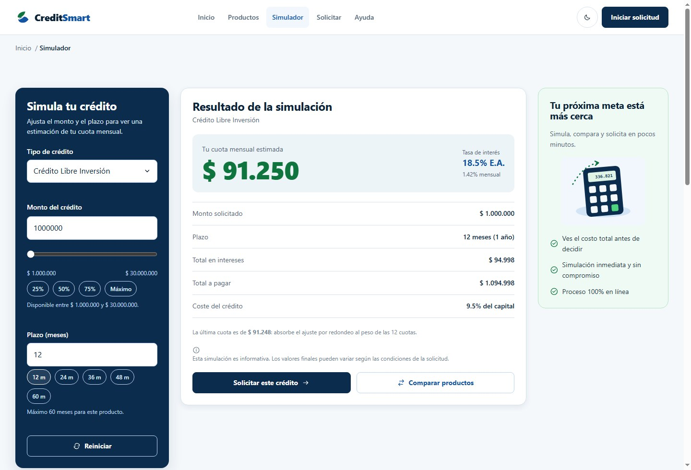
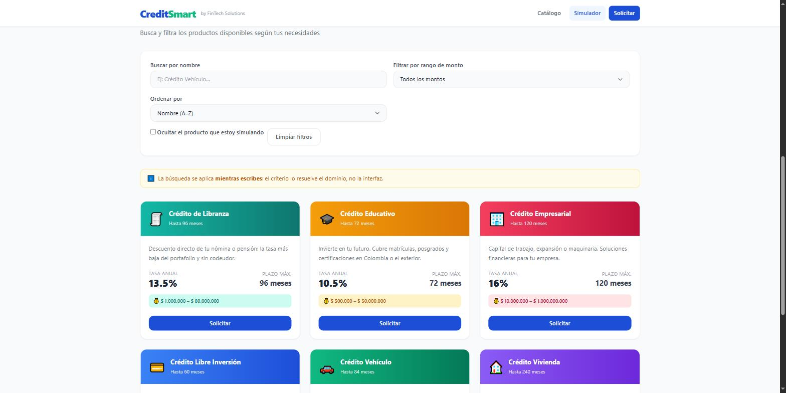
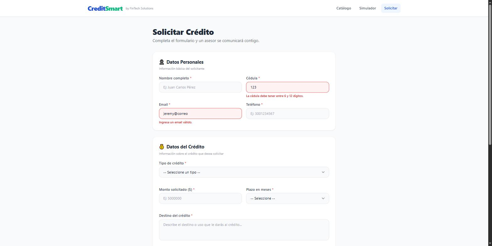
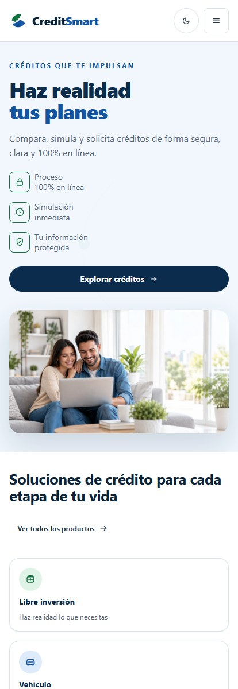
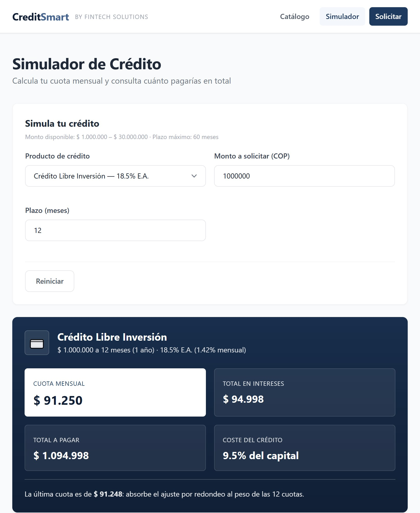
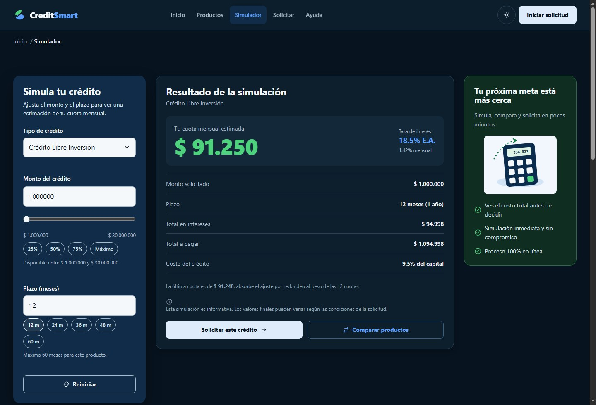

# CreditSmart — Aplicación web dinámica con React

Plataforma web para **consultar, simular y solicitar productos de crédito**.
Búsqueda en tiempo real, filtros dinámicos, cálculo automático de la cuota
mensual con tabla de amortización y formulario de solicitud por pasos,
completamente controlado.

Cubre tres actividades de Ingeniería Web sobre la misma arquitectura hexagonal:

1. La interfaz de la Actividad 1 (JavaScript vanilla, sin build) reescrita en
   **React + Vite + React Router** —
   [`docs/21`](./docs/21-migracion-a-react-ev2.md).
2. Un **rediseño completo de la interfaz** a partir del kit de diseño aprobado:
   tokens con tema claro/oscuro, iconografía propia, cinco pantallas y tres
   flujos rehechos — [`docs/23`](./docs/23-rediseno-ui-ux.md).
3. La **persistencia en la nube con Firebase / Firestore** (Actividad 3): CRUD
   de productos y solicitudes, consultas por correo y manejo de errores —
   [`docs/24`](./docs/24-integracion-firebase-ev3.md).

En ninguna se tocó el dominio: en la 2 cambió el adaptador de interfaz, y en la
3, el adaptador de persistencia. Esa es la tesis que la arquitectura sostiene.

| Dato | Valor |
|---|---|
| Integrantes | Jeremy Ivan Pedraza Hernández · Jossy Esteban Paternina Julio |
| Docente | Jorge Armando Julio |
| Curso | Ingeniería Web — PREICA2602B010133 |
| Institución | Institución Universitaria Digital de Antioquia — 2026-S2 |
| Entregas anteriores | Actividad 1 (tag `ev1-entrega`) · Actividad 2 (rama `ev2-react`) |
| Entrega actual | Actividad 3 — Firebase, rama `ev3-firebase` |

---

## 1. Tecnologías utilizadas

| Tecnología | Versión | Para qué |
|---|---|---|
| [React](https://react.dev) | 19 | Componentes, estado con hooks, render declarativo |
| [React Router](https://reactrouter.com) | 7 | Enrutado SPA (`/`, `/productos`, `/simulador`, `/solicitar`, `/mis-solicitudes`, `/ayuda`, 404) |
| [Vite](https://vite.dev) | 8 | Servidor de desarrollo y empaquetado |
| [Firebase](https://firebase.google.com) / Firestore | 12 | Persistencia en la nube (NoSQL), CRUD y consultas |
| JavaScript | ES2022 (módulos ES) | Dominio, aplicación e infraestructura, sin dependencias |
| CSS3 | — | 7 hojas en cascada explícita, Grid y Flexbox, mobile-first, tema claro/oscuro |
| Node.js | ≥ 18 (probado en 22.14) | Entorno de desarrollo |

Sin Tailwind, sin Sass, sin CSS-in-JS y sin librería de componentes: el CSS está
escrito a mano. Tampoco hay webfont — la tipografía es la pila del sistema, así
que no hay descarga ni bloqueo de render.

El núcleo de negocio **no depende de React**: son módulos ES estándar que se
ejecutan igual en Node (así corre la suite de pruebas) que en el navegador.

---

## 2. Instalación y ejecución

```bash
git clone <url-del-repositorio>
cd crediSmart

npm install        # instala React, React Router, Vite y Firebase
cp .env.example .env   # y rellena las credenciales de Firebase (ver §2.1)
npm run dev        # servidor de desarrollo -> http://localhost:5173
```

Sin `.env` la app arranca igual, en **modo degradado**: el catálogo se sirve
desde los datos locales y las solicitudes quedan solo en memoria. Con `.env`
configurado, todo pasa por Firestore.

### 2.1 Configuración de Firebase (Actividad 3)

CreditSmart persiste el catálogo y las solicitudes en **Cloud Firestore**. Para
apuntar a tu propio proyecto:

1. **Crear el proyecto** en [Firebase Console](https://console.firebase.google.com)
   → *Agregar proyecto*.
2. **Registrar una app web** (`</>`) y copiar el objeto `firebaseConfig`.
3. **Habilitar Firestore**: *Compilación → Firestore Database → Crear base de
   datos → modo de prueba* (reglas abiertas 30 días, suficiente para la
   entrega). **Este paso es obligatorio**: sin él la API de Firestore está
   deshabilitada y las lecturas/escrituras fallan.
4. `cp .env.example .env` y pegar los valores en las variables
   `VITE_FIREBASE_*`. `.env` está en `.gitignore`: **nunca se sube al repo**.
5. `npm run dev`. Al abrir el catálogo por primera vez, la colección `productos`
   se **siembra sola** con el catálogo base; las solicitudes se guardan en
   `solicitudes`.

**Colecciones de Firestore**

| Colección | Escribe | Lee | Operaciones |
|---|---|---|---|
| `productos` | siembra automática | Catálogo, Home, Simulador, Solicitud | `getDocs`, `setDoc` (seed) |
| `solicitudes` | Formulario de solicitud | Página *Mis solicitudes* | `addDoc`, `getDocs`, `where` + `orderBy` |

La consulta de *Mis solicitudes* combina `where('applicantEmail','==',correo)` con
`orderBy('createdAt','desc')`. Esa combinación pide un **índice compuesto** que
Firestore ofrece crear con un clic la primera vez (el enlace aparece en la
consola del navegador). Mientras el índice no exista, la app **degrada** a
filtrar por `where` y ordenar en cliente, así que sigue funcionando.

Todas las operaciones van dentro de `try/catch`; los errores se muestran al
usuario mediante avisos (toasts) y estados de error en pantalla. Un tope de
tiempo por operación convierte una desconexión de red en un error visible en
lugar de un cuelgue.

Otros comandos:

```bash
npm run build      # empaqueta para producción en dist/
npm run preview    # sirve dist/ para revisar el empaquetado
```

### Despliegue en Apache / Laragon

```bash
npm run build
```

`dist/` ya incluye el `.htaccess` (viene de `public/.htaccess`), que reescribe
las rutas limpias hacia `index.html`: así recargar en `/simulador` o
`/productos` funciona en lugar de devolver 404. Requiere `mod_rewrite`, activo
por defecto en Laragon. Para Nginx el equivalente es:

```nginx
location / { try_files $uri $uri/ /index.html; }
```

---

## 3. Capturas de pantalla

### Inicio (`/`)

Hero con la propuesta de valor y las señales de confianza, accesos rápidos a
los seis productos y banda institucional con cifras comprobables.


### Simulador (`/simulador`)

Espacio de trabajo en tres zonas: se ajusta a la izquierda, se ve la cifra en el
centro y el panel de confianza acompaña a la derecha. La cuota se recalcula al
cambiar producto, monto o plazo, sin pulsar ningún botón. Todos los importes en
formato COP.



### Catálogo (`/productos`) — búsqueda, filtros y ordenamiento

Barra lateral con búsqueda mientras se escribe, filtro por tipo, deslizador de
monto, plazo y cinco criterios de orden.



### Solicitud (`/solicitar`) — validación en tiempo real

Once campos en tres pasos más confirmación. Los mensajes de error los produce el
dominio, y el de un campo solo aparece cuando el usuario ya pasó por él.



### Responsive

Una columna en móvil (414 px) y dos en tableta (820 px); tres en escritorio.





### Tema oscuro

El sitio sigue la preferencia del sistema operativo y el botón de la barra
permite forzar claro u oscuro. La elección se recuerda en el navegador.



---

## 4. Funcionalidades

| Funcionalidad | Dónde está |
|---|---|
| Accesos rápidos a los 6 productos con `.map()` y `key` única | `pages/HomePage.jsx` + `components/ProductTile.jsx` |
| Catálogo completo con tarjeta por producto | `pages/ProductsPage.jsx` + `components/CreditCard.jsx` |
| Búsqueda por nombre **mientras se escribe** | `components/SearchBar.jsx` + `hooks/useCreditSearch.js` |
| Filtro por rango de monto (5 rangos, deslizador accesible) | `components/AmountRangeFilter.jsx` |
| Filtro por tipo de crédito y por plazo | `hooks/useCatalogRefinement.js` |
| Ordenamiento con `.sort()` (5 criterios) | `components/SortSelect.jsx` + `hooks/useProductSorting.js` |
| Limpiar filtros | `hooks/useCreditSearch.js` |
| Cálculo automático de la cuota mensual | `hooks/useSimulation.js` + `domain/services/CreditSimulationService.js` |
| Monto con campo, deslizador y atajos sincronizados | `components/SimulatorForm.jsx` |
| Total en intereses, total a pagar y coste del crédito | `components/SimulationResult.jsx` |
| Tabla de amortización con reparto capital/interés | `components/AmortizationTable.jsx` |
| Puente simulador → solicitud con prellenado | `components/SimulationResult.jsx` + `pages/ApplicationPage.jsx` |
| Formulario controlado de 11 campos en 3 pasos | `pages/ApplicationPage.jsx` + `components/FormField.jsx` |
| Validación en vivo de correo, cédula, montos e ingresos | `hooks/useApplicationForm.js` + `application/usecases/ValidateCreditApplicationDraftUseCase.js` |
| Radicado y persistencia de la solicitud en Firestore (`addDoc`) | `infrastructure/persistence/FirestoreCreditApplicationRepository.js` |
| Catálogo leído desde Firestore (`getDocs`) con siembra automática | `infrastructure/persistence/FirestoreCreditProductRepository.js` |
| Página *Mis solicitudes*: consulta por correo (`where` + `orderBy`) | `pages/MyApplicationsPage.jsx` + `hooks/useMyApplications.js` + `application/usecases/ListMyApplicationsUseCase.js` |
| Estados de carga y error en las lecturas remotas | `hooks/useMyApplications.js` + `hooks/useCreditProducts.js` |
| Preguntas frecuentes derivadas del catálogo | `pages/HelpPage.jsx` |
| Avisos accesibles (toasts) | `infrastructure/notification/ToastNotifier.js` |
| Tema claro / oscuro / automático | `assets/css/02-tokens.css` + `components/ThemeToggle.jsx` |
| Iconografía propia, 36 trazos inline con `currentColor` | `components/Icon.jsx` |
| Diseño responsive mobile-first | `assets/css/07-responsive.css` |
| Identidad visual: 3 colores, sin degradados de producto | `assets/css/02-tokens.css` ([doc 22](./docs/22-identidad-visual.md), [doc 23](./docs/23-rediseno-ui-ux.md)) |

---

## 5. Estructura de carpetas

```
crediSmart/
├── index.html                  Punto de entrada de Vite; aplica el tema antes de pintar
├── package.json                Dependencias y scripts
├── vite.config.js              Configuración del empaquetador
├── public/
│   ├── .htaccess               Reescritura SPA para Apache (se copia a dist/)
│   └── assets/                 Iconos, logos, ilustraciones y fotografías
├── assets/css/                 7 hojas en cascada; tokens con tema claro/oscuro (doc 23)
├── src/
│   ├── main.jsx                Composition Root: construye el grafo y monta React
│   ├── App.jsx                 Armazón (navbar, pie, salto al contenido) y tabla de rutas
│   ├── data/
│   │   └── creditsData.js      Catálogo, rangos de monto y plazos (dato puro)
│   ├── components/             21 componentes reutilizables, props desestructuradas
│   ├── pages/                  7 páginas, una por ruta (incl. Mis solicitudes)
│   ├── hooks/                  9 hooks: estado de UI + invocación de casos de uso
│   ├── context/
│   │   └── DependenciesProvider.jsx   Inyecta los casos de uso en el árbol React
│   ├── domain/                 Entidades, value objects, servicios, puertos, errores
│   ├── application/            Casos de uso, DTOs, mappers, Result
│   ├── infrastructure/         Adaptadores: persistencia, formato, reloj, ids, avisos
│   └── config/                 AppConfig, Container, dependencies, routes, productVisualMap
├── tests/
│   ├── 01-domain-application.mjs   Dominio y aplicación (85 aserciones)
│   └── 02-boot-jsdom.mjs           Arranque de la interfaz: 7 rutas en un DOM simulado
└── docs/                       24 documentos + capturas + kit de rediseño
```

Las tres carpetas que pide la rúbrica —`components/`, `pages/`, `data/`— están
en la raíz de `src/`. Las cuatro capas de la arquitectura conviven con ellas:
`components/`, `pages/`, `hooks/` y `context/` **son** la capa de presentación.

---

## 6. Arquitectura

### 6.1 Hexagonal: la interfaz es un adaptador

```
                 ┌──────────────────────────────┐
   React  ─────► │  application (casos de uso)  │ ─────► adaptadores
  (pages,        │        domain (núcleo)       │        (Firestore, localStorage,
   hooks)        └──────────────────────────────┘         Intl, crypto…)
```

El dominio define **puertos** (interfaces) y la infraestructura los implementa.
El dominio no sabe que existe localStorage; localStorage no sabe que existe una
regla de crédito.

### 6.2 Regla de dependencia

```
presentación (React) ──► application ──► domain ◄── infrastructure
```

Las flechas apuntan siempre hacia el núcleo. Tres reglas verificables:

```bash
grep -rn "from '\.\./\.\./\(application\|infrastructure\|presentation\|config\)" src/domain/
grep -rn "from '\.\./\.\./\(infrastructure\|presentation\|config\)"              src/application/
grep -rn "infrastructure" src/components src/pages src/hooks src/context src/App.jsx
```

Las tres devuelven **cero resultados**.

### 6.3 Reparto de responsabilidades en React

| Pieza | Puede | No puede |
|---|---|---|
| `components/` | Recibir props y devolver JSX | Tener estado, efectos ni llamar a casos de uso |
| `pages/` | Componer, decidir qué se muestra y en qué orden | Consultar datos por su cuenta |
| `hooks/` | Guardar estado de UI, invocar casos de uso, desenvolver `Result` | Contener reglas de negocio |
| casos de uso | Orquestar y devolver `Result` con DTOs | Tener reglas propias o tocar el DOM |
| dominio | Todas las reglas e invariantes | Conocer React, el DOM, la red o el almacenamiento |

Fuera de un hook no circula ni un `Result` ni una entidad: solo datos planos.

### 6.4 Dónde acaba el dominio y empieza la interfaz

El rediseño obligó a trazar esa frontera en sitios concretos, y el criterio es
siempre el mismo: **¿esto seguiría siendo verdad sin pantalla?**

| Decisión | Quién la resuelve |
|---|---|
| Buscar por nombre, acotar por rango de monto | Dominio (`ProductSearchCriteria`, `AmountRange.overlaps()`) |
| Filtrar por tipo de crédito y por plazo | Presentación (`useCatalogRefinement`) |
| Ordenar los resultados | Presentación (`useProductSorting`) |
| Qué pictograma y qué frase lleva cada producto | Presentación (`config/productVisualMap.js`) |
| Tema claro u oscuro | Presentación (`ThemeToggle` + `localStorage`) |
| Paso actual del formulario | Presentación (estado local de la página) |

El dominio nunca almacena una ruta de SVG, un texto publicitario ni un paso de
formulario.

### 6.5 Contratos verificables

JavaScript no tiene `interface`, así que se declaran explícitamente:

```js
export const ICreditProductRepository = defineContract('ICreditProductRepository',
  ['findAll', 'findById', 'findByCriteria', 'count']);
```

`assertImplements(instancia, Contrato)` comprueba en el contenedor que el
adaptador implementa de verdad todos los métodos, y `eagerResolveAll()`
construye el grafo al arrancar: un contrato roto falla al cargar la página, no
a mitad de una interacción.

### 6.6 Inyección de dependencias

`config/dependencies.js` es el **único** archivo con `new` de clases concretas.
`DependenciesProvider` traduce el contenedor a un objeto **congelado** de casos
de uso, así que un componente no puede pedir un repositorio: no está ahí.

```js
const { simulateCredit } = useDependencies();   // un caso de uso, no un adaptador
```

La única excepción es el puerto `IMoneyFormatter`, que el resumen de la
solicitud necesita para dar formato a un monto recién tecleado. Se inyecta el
**puerto**, no el adaptador: la vista sigue sin conocer `Intl`.

---

## 7. Hooks de React usados

| Hook | Dónde y para qué |
|---|---|
| `useState` | Texto de búsqueda, rango, tipo, plazo, orden, producto/monto/plazo del simulador, paso actual, los 11 campos del formulario, campos tocados, envío en curso, radicado, tema |
| `useEffect` | Cargar catálogo, rangos y nombres de producto; relanzar la búsqueda; recalcular la cuota; validar el borrador; aplicar el prellenado; fijar el título; seguir el tema del sistema |
| `useMemo` | Ordenar y afinar el catálogo sin recalcular en cada render; resolver el prellenado; construir el objeto de dependencias una sola vez |
| `useCallback` | Acciones estables (`setValue`, `submit`, `reset`, `clearFilters`, `toggleType`) para no re-renderizar los componentes hijos |
| `useRef` | Marcar que el prellenado ya se aplicó, para no pisar lo que el usuario escriba |
| `useContext` | Acceso a las dependencias inyectadas (`useDependencies`) |
| `useSearchParams` | Leer el traspaso del simulador (`?product=&amount=&term=`) |
| Hooks propios | `useCreditProducts`, `useCreditSearch`, `useCatalogRefinement`, `useProductSorting`, `useSimulation`, `useApplicationForm`, `useDocumentTitle`, `useDependencies` |

Todo `useEffect` asíncrono marca `cancelled` en su función de limpieza, porque
React monta dos veces en modo estricto.

---

## 8. Verificación

```bash
node tests/01-domain-application.mjs   # 85 aserciones -> TODO OK
npm install jsdom --no-save
node tests/02-boot-jsdom.mjs           # las 7 rutas montan y pintan -> TODO OK
npm run build                          # compila sin errores
```

Y las reglas del sistema de estilos:

```bash
# Ningún color fuera del archivo de tokens
grep -rn "#[0-9a-fA-F]\{3,8\}" assets/css/ --include=*.css | grep -v 02-tokens.css
```

Comprobado además **en navegador, pulsando la aplicación**: navegación entre las
siete rutas sin recarga, recarga directa en rutas profundas, búsqueda
incremental, recálculo de la cuota, traspaso del simulador a la solicitud con
prellenado, los tres pasos del formulario, envío real con radicado y aviso,
404 en una ruta inexistente, tema claro y oscuro, y sin desplazamiento
horizontal en 375, 414, 768, 820, 1024, 1440 y 1920 px. Sin errores en consola.

Esa pasada por el navegador destapó tres fallos que las capturas automatizadas
daban por buenos —incluido un formulario que se autoenviaba al llegar al último
paso—. Están documentados con su causa en
[`docs/23 §12`](./docs/23-rediseno-ui-ux.md).

---

## 9. Documentación

**Índice maestro: [`docs/master.md`](./docs/master.md)** — 24 documentos sobre el
patrón de diseño, las entidades, los value objects, los contratos, los casos de
uso, los adaptadores, la inyección de dependencias, el enrutado, los estilos,
los flujos end-to-end, las recetas de extensión y las convenciones.

Lecturas recomendadas para esta entrega:

| Documento | Qué responde |
|---|---|
| [24 — Integración con Firebase (Actividad 3)](./docs/24-integracion-firebase-ev3.md) | La persistencia en la nube: `FirebaseClient`, los repositorios de Firestore (CRUD con `addDoc`/`getDocs`/`where`+`orderBy`), la página *Mis solicitudes*, las variables de entorno, la degradación y el manejo de errores |
| [23 — Rediseño UI/UX](./docs/23-rediseno-ui-ux.md) | El rediseño completo: tokens con tema día/noche, iconografía propia, las cinco pantallas, el puente simulador → solicitud, qué se decidió NO pintar del mockup y los tres fallos que solo aparecieron en el navegador |
| [21 — Migración a React](./docs/21-migracion-a-react-ev2.md) | Qué cambió y qué no al pasar de vanilla a React, y por qué |
| [22 — Identidad visual](./docs/22-identidad-visual.md) | La corrección de paleta previa: por qué se retiraron los seis degradados de producto |
| [02 — Arquitectura hexagonal](./docs/02-arquitectura-hexagonal.md) | Qué es un puerto y qué es un adaptador |
| [03 — Clean Architecture y capas](./docs/03-clean-architecture-capas.md) | Quién puede importar a quién |
| [10 — Casos de uso y DTOs](./docs/10-casos-de-uso-y-dtos.md) | Por qué la interfaz recibe DTOs y nunca entidades |
| [18 — Guía de extensión](./docs/18-guia-de-extension.md) | Recetas paso a paso para añadir producto, campo o página |

El encargo del que partió el rediseño está en
[`docs/plans/brief-rediseno-ui-ux.md`](./docs/plans/brief-rediseno-ui-ux.md):
estado del front antes del cambio, restricciones y criterios de aceptación. Los
recursos gráficos que produjo (iconos, logos, ilustraciones y fotografías) están
en `public/assets/`.

La documentación académica está en [`docs/iudigital_doc/`](./docs/iudigital_doc/):
`EV1/` con el documento de arquitectura de la Actividad 1 y su generador, y
`EV2/` con la rúbrica de esta entrega.
